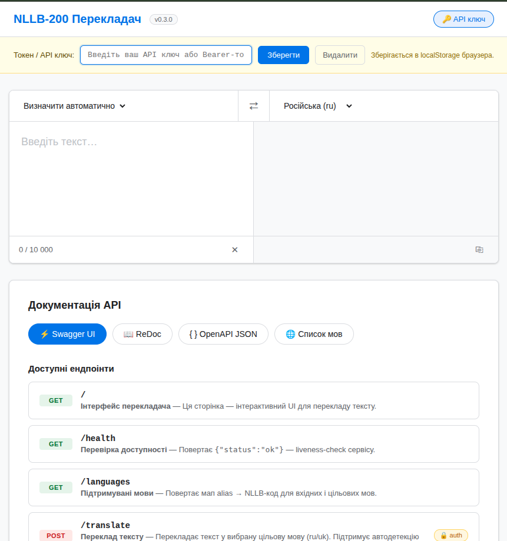
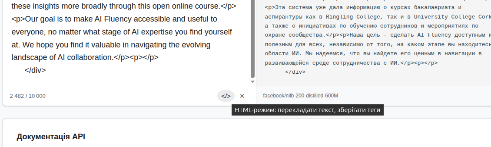

# NLLB-200 Translation service

API-сервіс перекладу у підтримувані цільові мови на базі `facebook/nllb-200-1.3B` через CTranslate2 (INT8).

## Підготовка: конвертація моделі

Перед першим запуском потрібно конвертувати HuggingFace модель у формат CTranslate2 INT8.
Це робиться один раз:

```bash
python3 -m venv .venv-convert
source .venv-convert/bin/activate
pip install -r requirements-convert.txt

python scripts/convert_model.py \
  --model facebook/nllb-200-1.3B \
  --output /path/to/storage/ct2-nllb-1.3b-nondistilled-int8 \
  --quantization int8
```

Після конвертації встановіть `NLLB_CT2_MODEL_DIR` на шлях до директорії з моделлю.

## Локальний запуск (venv)

```bash
python3 -m venv .venv
source .venv/bin/activate
pip install -r requirements.txt
cp .env.example .env
uvicorn app.main:app --host 0.0.0.0 --port 8000
```

## Запуск через Docker Compose

```bash
cp .env.example .env
mkdir -p ./storage
docker network create shared_net || true
docker compose up --build
```

Щоб модель не завантажувалась з інтернету після кожного рестарту:
- використовуйте постійний `STORAGE_PATH` (bind mount в `/app/storage`);
- модель у коді завжди завантажується з `cache_dir=NLLB_MODEL_CACHE_DIR` (дефолт: `/app/storage/huggingface`);
- перший запуск зробіть з `NLLB_TRANSFORMERS_OFFLINE=0` для кешування моделі;
- після прогріву можна поставити `NLLB_TRANSFORMERS_OFFLINE=1` для офлайн-режиму.

## Деплоймент на сервер

### Вимоги

| Ресурс | Мінімум | Рекомендовано |
|--------|---------|---------------|
| RAM | 4 GB | 8 GB |
| CPU | 2 ядра | 4+ ядра |
| Диск | 10 GB | 20 GB |
| OS | Ubuntu 22.04+ / Debian 12+ | — |
| Docker | 24+ | — |
| Docker Compose | v2 | — |

### Перша установка

**1. Клонувати репозиторій та налаштувати оточення:**

```bash
git clone <repo-url> /opt/speech-translate-service
cd /opt/speech-translate-service
cp .env.example .env
```

Відредагувати `.env` — виставити секрети та потрібні параметри (мінімум `NLLB_BEARER_TOKEN` або `NLLB_API_KEY`).

**2. Підготувати директорію для моделі:**

```bash
mkdir -p /opt/storage/ct2-nllb-1.3b-nondistilled-int8
echo 'STORAGE_PATH=/opt/storage' >> .env
```

**3. Сконвертувати модель (один раз, потрібен інтернет):**

```bash
python3 -m venv .venv-convert
source .venv-convert/bin/activate
pip install -r requirements-convert.txt

python scripts/convert_model.py \
  --model facebook/nllb-200-1.3B \
  --output /opt/storage/ct2-nllb-1.3b-nondistilled-int8 \
  --quantization int8
```

Після конвертації можна увімкнути офлайн-режим — у `.env`:
```
NLLB_TRANSFORMERS_OFFLINE=1
```

**4. Підняти сервіс:**

```bash
docker network create shared_net || true
docker compose up -d --build
```

**5. Перевірити здоров'я:**

```bash
curl http://localhost:8000/health
```

---

### Оновлення сервісу

```bash
git pull
docker compose up -d --build
```

Docker Compose автоматично перезапустить контейнер з новим образом. Downtime — час білду + ініціалізації моделі (~30–60 с).

Якщо потрібен zero-downtime — запустіть новий контейнер на іншому порту, переключіть проксі (nginx/traefik), потім зупиніть старий.

---

### Логи та моніторинг

```bash
# Потік логів у реальному часі
docker compose logs -f nllb-service

# Останні 100 рядків
docker compose logs --tail=100 nllb-service

# Статус контейнера
docker compose ps
```

Сервіс автоматично перезапускається при падінні (`restart: unless-stopped`). При рестарті хоста Docker поверне контейнер, якщо демон налаштований на автозапуск:

```bash
sudo systemctl enable docker
```

---




## Swagger і OpenAPI

- Swagger UI: `http://localhost:8000/docs`
- OpenAPI JSON (runtime): `http://localhost:8000/openapi.json`
- OpenAPI JSON (зафіксована спека в репозиторії): `docs/openapi.json`
- Приклади запитів для IDE HTTP Client: `docs/translator_api.http`
- Integration guide для сторонніх сервісів: `docs/integration.md`

## API

### Health (public)

```bash
curl http://localhost:8000/health
```

### Languages (public)

```bash
curl http://localhost:8000/languages
```

### Translate (приклад -> RU, default)

```bash
curl -X POST http://localhost:8000/translate \
  -H 'Content-Type: application/json' \
  -H 'Authorization: Bearer change-me-token' \
  -d '{"text":"Hello, how are you?", "source_language":"en"}'
```

### Translate (приклад -> UK)

```bash
curl -X POST http://localhost:8000/translate \
  -H 'Content-Type: application/json' \
  -H 'Authorization: Bearer change-me-token' \
  -d '{"text":"Hello, how are you?", "source_language":"en", "target_language":"uk"}'
```

### Translate (приклад PL -> UK)

```bash
curl -X POST http://localhost:8000/translate \
  -H 'Content-Type: application/json' \
  -H 'Authorization: Bearer change-me-token' \
  -d '{"text":"Cześć, jak się masz?", "source_language":"pl", "target_language":"uk"}'
```

### Translate (приклад EN -> UK)

```bash
curl -X POST http://localhost:8000/translate \
  -H 'Content-Type: application/json' \
  -H 'Authorization: Bearer change-me-token' \
  -d '{"text":"Hello, how are you?", "source_language":"en", "target_language":"uk"}'
```

## Контроль доступу (API key / Bearer token)

- Auth для `POST /translate` керується env-параметрами `NLLB_API_KEY_ENABLED` і `NLLB_BEARER_TOKEN_ENABLED`.
- Якщо увімкнено `NLLB_API_KEY_ENABLED=true`, клієнт може передавати `X-API-Key`.
- Якщо увімкнено `NLLB_BEARER_TOKEN_ENABLED=true`, клієнт може передавати `Authorization: Bearer <token>`.
- Якщо обидва режими увімкнені, достатньо одного валідного методу.
- Якщо обидва режими вимкнені, авторизація не потрібна.

## Підтримувані мови

Вхідні мови (приклади для payload):
- `ar` -> `arb_Arab`
- `en` -> `eng_Latn` (англійська)
- `pl` -> `pol_Latn` (Польща)
- `sk` -> `slk_Latn` (Словаччина)
- `hu` -> `hun_Latn` (Угорщина)
- `ro` -> `ron_Latn` (Румунія)
- `md` -> `ron_Latn` (Молдова)
- `be` -> `bel_Cyrl` (Білорусь)
- `ru` -> `rus_Cyrl` (Росія)
- `tr` -> `tur_Latn` (Туреччина)

Цільові мови:
- `ru` -> `rus_Cyrl`
- `uk` -> `ukr_Cyrl`

Параметр `target_language` у запиті опційний. Якщо не переданий, сервіс використовує дефолт із `NLLB_DEFAULT_TARGET_LANGUAGE`.
Параметр `source_language` у запиті опційний. Якщо не переданий, сервіс автоматично визначає мову вхідного тексту.

Повний список мов які можна підключити
chttps://huggingface.co/facebook/nllb-200-1.3B/blob/main/README.md

## Налаштування

Через env (`.env`):
- `NLLB_MODEL_NAME` (default: `facebook/nllb-200-1.3B`)
- `NLLB_CT2_MODEL_DIR` (default: `/app/storage/ct2-nllb-1.3b-nondistilled-int8`, шлях до конвертованої CTranslate2 моделі)
- `NLLB_CT2_DEVICE` (default: `cpu`, допустимі: `cpu`, `cuda`)
- `NLLB_CT2_INTER_THREADS` (default: `1`, кількість потоків CTranslate2 інференсу)
- `NLLB_DEFAULT_TARGET_LANGUAGE` (default: `ru`, підтримувані: `ru`, `uk`)
- `NLLB_API_KEY_ENABLED` (default: `false`, допустимі: `true|false`)
- `NLLB_API_KEY` (default: `change-me`, обов'язковий якщо `NLLB_API_KEY_ENABLED=true`)
- `NLLB_BEARER_TOKEN_ENABLED` (default: `false`, допустимі: `true|false`)
- `NLLB_BEARER_TOKEN` (default: `change-me-token`, обов'язковий якщо `NLLB_BEARER_TOKEN_ENABLED=true`)
- `NLLB_RATE_LIMIT_ENABLED` (default: `false`, вмикає rate limit для `/translate`)
- `NLLB_RATE_LIMIT_REQUESTS` (default: `60`, кількість запитів у вікні)
- `NLLB_RATE_LIMIT_WINDOW_SECONDS` (default: `60`, розмір вікна rate limit у секундах)
- `NLLB_MODEL_CACHE_DIR` (default: `/app/storage/huggingface`, локальний кеш токенайзера)
- `NLLB_TRANSFORMERS_OFFLINE` (default: `0`, `1` вмикає офлайн-режим HuggingFace)
- `NLLB_MAX_LENGTH` (default: `1024`; `0` = без обмеження довжини генерації; `1024` ~= до однієї сторінки друкованого тексту)
- `NLLB_REQUEST_TEXT_MAX_LENGTH` (default: `10000`, верхня межа довжини поля `text` у запиті `/translate`)
- `STORAGE_PATH` (default: `./storage`, хостова директорія для кешу моделі/даних сервісу)

## Релізний Чекліст

1. Оновити `.env` для auth/rate limit і перевірити, що секрети не потрапляють у git.
2. Запустити `pytest` для `tests/test_translator.py` і `tests/test_auth.py`.
3. Перегенерувати `docs/openapi.json` з поточного коду.
4. Підняти сервіс і перевірити `GET /health`, `GET /languages`, `POST /translate`.
5. Перевірити `401` (без токена/ключа), `422` (невалідний payload), `429` (якщо rate limit увімкнено).

## Rollback План

1. Відкотити деплой на попередній образ/коміт.
2. Вимкнути нові фічі через env:
   - `NLLB_BEARER_TOKEN_ENABLED=false`
   - `NLLB_RATE_LIMIT_ENABLED=false`
3. Перезапустити сервіс і перевірити `GET /health`.
4. Повторити smoke-тести (`/languages`, `/translate`) на відновленій версії.

Backward compatibility:
- Старі клієнти, що не передають `target_language`, продовжать працювати без змін.
- Клієнти тепер мають явно передавати `source_language` у кожному запиті `/translate`.
- `NLLB_TGT_LANG` більше не використовується в API-логіці вибору цілі; замість нього використовується `NLLB_DEFAULT_TARGET_LANGUAGE`.
